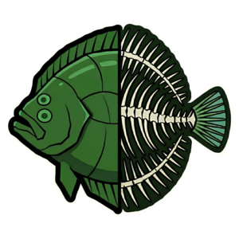
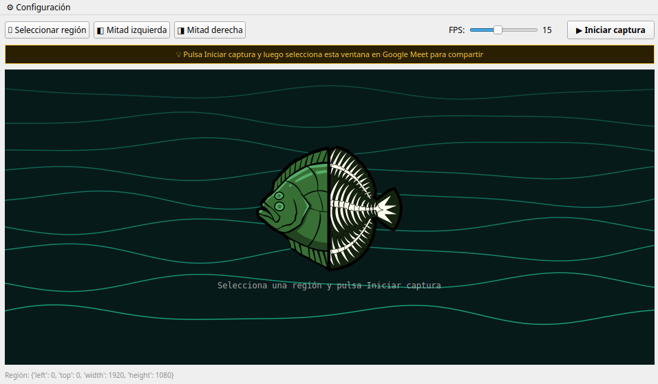

<p align="center">
  
</p>

<h1 align="center">Roda Mirror</h1>

<p align="center">
  Share half your screen in Google Meet — without exposing the rest.
</p>

---

## What is it?

Roda Mirror is a lightweight tool that captures a region of your screen and displays it in a dedicated window. You can then share that window in Google Meet, so your audience only sees exactly what you want — nothing more.

It was built for situations where you need to work across two things at once (a presentation and a terminal, for example) on a wide monitor, while keeping the other half of your screen private.

## How it works

1. **Select a region** — choose the left half, right half, or draw a custom area with your mouse
2. **Start capture** — the app begins mirroring that region in real time inside its own window
3. **Share in Google Meet** — go to Present → A window → select **Roda Mirror**

That's it. Your audience sees the mirrored region. You keep working freely on the rest of your screen.

<p align="center">
  
</p>

---

## Technical overview

### Screen capture pipeline

Roda Mirror uses **mss** (Multiple Screen Shot) to capture the screen. mss accesses the display server directly via the OS's native interface — on Linux this means reading pixel data from the X11 framebuffer using `XShmGetImage`, a shared memory extension that avoids copying pixel data through the network socket. This makes it significantly faster than tools that go through standard X11 requests.

At each tick of a `QTimer` (configurable between 5 and 30 FPS), the app:

1. Calls `mss.grab(region)` with the defined bounding box `{left, top, width, height}`
2. Receives a raw BGRA pixel buffer
3. Converts it from BGRA to RGB using **Pillow** (`Image.frombytes` + `.convert("RGB")`)
4. Wraps the RGB buffer into a `QImage` using `Format_RGB888`
5. Scales it to fit the display area with `QPixmap.scaled()` using smooth transformation
6. Pushes it to a `QLabel` via `setPixmap()`

### Why the BGRA → RGB conversion?

X11 returns pixel data in BGRA format (Blue, Green, Red, Alpha). PyQt5's `QImage` in older versions does not expose a native BGRA format constant, so a direct assignment would produce incorrect colors. Pillow handles the channel reordering efficiently before handing the buffer to Qt.

### Region selection

The custom region selector is an `OverlaySelector` widget — a fullscreen, semi-transparent, frameless window that sits on top of everything (`Qt.WindowStaysOnTopHint`). It captures mouse press, move and release events to define a `QRect`, then passes the screen coordinates back to the main window.

### Window sharing in Google Meet

Google Meet on Chrome (X11) enumerates visible windows via the XDG screen capture protocol or directly through X11's window tree. Roda Mirror maintains a standard decorated window (with title bar) so it remains visible and selectable in Meet's window picker at all times — including after capture has started.

### Stack

| Component | Role |
|---|---|
| `mss` | Low-level screen region capture via X11 shared memory |
| `Pillow` | BGRA → RGB pixel buffer conversion |
| `PyQt5` | GUI, window management, render loop via QTimer |
| `QLabel + QPixmap` | Efficient pixel buffer display |
| `PyInstaller` | Bundles Python + dependencies into a single binary |
| `appimagetool` | Packages the binary into a portable AppImage |

---

## Requirements

- Linux x86_64
- Python 3
- PyQt5, mss, pillow

## Install dependencies

```bash
pip install PyQt5 mss pillow --break-system-packages
```

## Run

```bash
python3 screen_mirror.py
```

## Build AppImage

```bash
bash build_appimage.sh
```

## Download

Head to the [Releases](https://github.com/alfeijoo/roda-mirror/releases) section to download the latest AppImage — no installation required.
